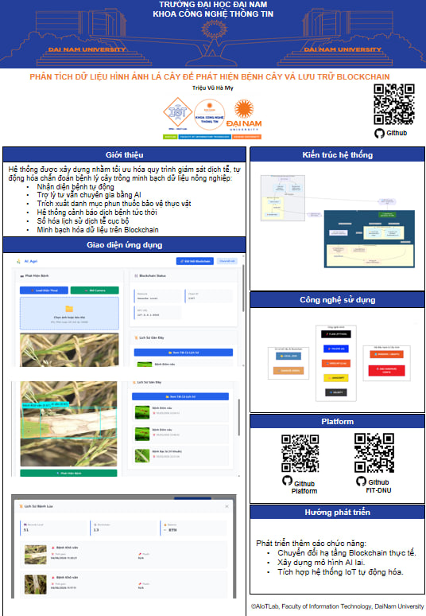

<h1 align="center">
🌾 Hệ Thống Phát Hiện Bệnh Lúa Thông Minh Kết Hợp AI & Blockchain
</h1>

<div align="center">
  
</div>

<br>

<div align="center">

[](#)
[](#)
[](#)
[](#)
[](#)
[](#)

</div>

<hr>

<h2 align="center">✨ Mô tả dự án</h2>

<p align="justify">
  <strong>AI_Agri</strong> là một hệ thống <strong>phát hiện bệnh lúa tự động</strong> sử dụng công nghệ <strong>Deep Learning (YOLOv8)</strong>, kết hợp với <strong>AI tư vấn tiếng Việt (Groq LLM)</strong> và <strong>Blockchain Smart Contract (Solidity)</strong> để lưu trữ dữ liệu bất biến. Hệ thống cung cấp:
  <br><br>
  ✅ <strong>Phát hiện bệnh lúa chính xác</strong> - YOLOv8 nhận diện 5 loại bệnh với bounding boxes<br>
  ✅ <strong>Tư vấn điều trị tiếng Việt</strong> - Groq AI (llama-3.3-70b) cung cấp lời khuyên chi tiết<br>
  ✅ <strong>Lưu trữ blockchain bất biến</strong> - Smart Contract trên Ganache local<br>
  ✅ <strong>Lịch sử hoàn chỉnh</strong> - JSON local + blockchain records với TX hash<br>
  ✅ <strong>Cảnh báo email tự động</strong> - Thông báo khi phát hiện bệnh<br>
  ✅ <strong>Giao diện web đầy đủ</strong> - Flask API + HTML5 Web3 integration<br>
</p>

<hr>

<h2 align="center">📦 Chuẩn Bị</h2>

### 🛠️ Phần Mềm & Công Nghệ

<div align="center">

[](#)
[](#)
[](#)
[](#)
[](#)
[](#)
[](#)

### 📱 Frontend & Giao Diện

[](#)
[](#)
[](#)
[](#)
[](#)

### 🔧 Công Cụ & Khác

[](#)
[](#)
[](#)
[](#)

</div>

<hr>

<h2 align="center">🍚 5 Loại Bệnh Lúa Được Phát Hiện</h2>

<div align="center">
<table>
  <tr>
    <th>#</th>
    <th>Tên Bệnh</th>
    <th>Tên Khoa Học</th>
    <th>Triệu Chứng & Tác Động</th>
  </tr>
  <tr>
    <td>1</td>
    <td><strong>🟢 Bệnh Bạc lá</strong></td>
    <td><em>Xanthomonas oryzae</em></td>
    <td>Lá vàng → bạc, mềm, ẩm. Gây mất năng suất 20-50%</td>
  </tr>
  <tr>
    <td>2</td>
    <td><strong>🟤 Bệnh Đốm nâu</strong></td>
    <td><em>Helminthosporium oryzae</em></td>
    <td>Đốm nâu hình bầu dục trên lá. Làm héo úa lá sớm</td>
  </tr>
  <tr>
    <td>3</td>
    <td><strong>🔴 Bệnh Đạo ôn</strong></td>
    <td><em>Pyricularia oryzae</em></td>
    <td>Vệt khô từ lá non → lá già. Ảnh hưởng thóc chắc</td>
  </tr>
  <tr>
    <td>4</td>
    <td><strong>🟡 Bệnh Khô vằn</strong></td>
    <td><em>Fusarium/Rhizoctonia</em></td>
    <td>Vằn khô vàng/nâu trên lá bẹ. Gây hạt không đầy</td>
  </tr>
  <tr>
    <td>5</td>
    <td><strong>🟢 Lá Khỏe Mạnh</strong></td>
    <td>-</td>
    <td>Không có dấu hiệu bệnh. Sinh trưởng bình thường</td>
  </tr>
</table>
</div>

<hr>

<h2 align="center">📁 Cấu Trúc Dự Án</h2>

<pre align="center">
📂 AI_Agri/
├── 📄 <strong>app_flask.py</strong>              # Flask API Backend (Port 5000) ⭐
├── 📄 <strong>app.py</strong>                   # Streamlit Alternative UI
├── 📄 <strong>blockchain_service.py</strong>    # Web3 Integration Module
├── 🌐 <strong>index.html</strong>               # Main Web Interface (Web3 enabled)
├── 📱 <strong>phone.html</strong>               # Mobile Responsive UI
├── 📦 <strong>requirements.txt</strong>        # Python Dependencies
├── 🤖 models/
│   └── <strong>best.pt</strong>                # YOLOv8 Pretrained Model
├── ⛓️ blockchain/
│   ├── contracts/
│   │   └── <strong>RiceDiseaseRecord.sol</strong>  # Smart Contract
│   ├── migrations/
│   ├── build/contracts/
│   │   └── RiceDiseaseRecord.json    # ABI JSON
│   ├── truffle-config.js
│   └── package.json
├── 📊 dataset/
│   ├── train/  (Training images & labels)
│   ├── valid/  (Validation images)
│   └── test/   (Test images)
├── 💾 history/
│   ├── <strong>data.json</strong>              # Local Records Database
│   ├── images/                     # Original & Annotated Images
│   └── phone_uploads/              # Mobile Uploads
├── 📚 Documentation/
│   ├── README.md                   # This file
│   ├── SYSTEM_ARCHITECTURE.md      # Detailed Architecture
│   ├── ARCHITECTURE_DIAGRAM.md     # Mermaid Diagrams
│   └── RUN_COMMANDS.md             # Setup Commands
└── 📝 package.json                 # Project Metadata
</pre>

<hr>

<h2 align="center">🚀 Hướng Dẫn Cài Đặt & Chạy</h2>

### I. Yêu Cầu Hệ Thống

- **OS**: Windows 10/11, macOS, hoặc Linux
- **Python**: 3.8+ (khuyến nghị 3.10+)
- **Node.js**: v14+ (cho Truffle & Ganache)
- **RAM**: 4GB+ (8GB được khuyến nghị)
- **Storage**: 5GB trống

### II. Cài Đặt Python & Dependencies

<strong>Bước 1: Tạo Virtual Environment</strong>

```powershell
# Windows
python -m venv venv
venv\Scripts\activate

# macOS/Linux
python3 -m venv venv
source venv/bin/activate
```

<strong>Bước 2: Cài Đặt Python Packages</strong>

```powershell
pip install -r requirements.txt
```

**Hoặc cài thủ công:**

```powershell
pip install Flask>=2.0.0
pip install flask-cors>=3.0.10
pip install ultralytics>=8.0.0
pip install groq>=0.4.0
pip install web3>=1.10.0
pip install pillow>=10.0.0
pip install opencv-python>=4.8.0
pip install numpy>=1.24.0
pip install requests>=2.31.0
```

### III. Cài Đặt Blockchain (Ganache & Truffle)

<strong>Bước 1: Cài Đặt Ganache</strong>

```powershell
# Cài Ganache CLI
npm install -g ganache

# Hoặc tải Ganache GUI từ: https://trufflesuite.com/ganache/
```

<strong>Bước 2: Khởi Động Ganache</strong>

```powershell
# Terminal 1: Chạy Ganache (Port 8545)
ganache --host 127.0.0.1 --port 8545 --deterministic

# Kết quả: 10 accounts, 100 ETH mỗi account
```

<strong>Bước 3: Cài Đặt & Deploy Smart Contract</strong>

```powershell
# Terminal 2: Deploy contract
cd blockchain
npm install
truffle migrate --network development

# Output: Contract deployed tại: 0x5b1869D9A4C187F2EAa108f3062412ecf0526b24
```

### IV. Chạy Flask API Server

```powershell
# Terminal 3: Chạy Flask
cd ..
python app_flask.py

# Server running at: http://localhost:5000
```

### V. Mở Ứng Dụng

```
Mở trình duyệt: http://localhost:5000
```

<hr>

<h2 align="center">⚙️ Cấu Hình & Thiết Lập</h2>

### Groq API Key (Bắt Buộc)

1. Lấy API Key từ: https://console.groq.com/
2. Mở `app_flask.py`, dòng ~30:

```python
GROQ_API_KEY = "your_api_key_here"
client_groq = Groq(api_key=GROQ_API_KEY)
```

### Smart Contract Address

Sau khi deploy thành công với Truffle:
- Contract Address: `0x5b1869D9A4C187F2EAa108f3062412ecf0526b24`
- Nằm trong file: `blockchain_service.py` line ~40

### Email Notifications (Tùy Chọn)

```python
# app_flask.py
sender_email = "wuveil215@gmail.com"
receiver_email = "hamy5dvdsz@gmail.com"
app_password = "kkeu aaum yikq zqlo"
```

⚠️ **Lưu ý**: Cần bật 2-Factor Authentication và tạo App Password trên Gmail

<hr>

<h2 align="center">📋 API Endpoints</h2>

<div align="center">
<table>
  <tr>
    <th>Method</th>
    <th>Endpoint</th>
    <th>Input</th>
    <th>Output</th>
    <th>Mô Tả</th>
  </tr>
  <tr>
    <td>GET</td>
    <td><code>/</code></td>
    <td>-</td>
    <td>HTML</td>
    <td>Serve trang chính (index.html)</td>
  </tr>
  <tr>
    <td>GET</td>
    <td><code>/api/health</code></td>
    <td>-</td>
    <td>JSON: {status, blockchain}</td>
    <td>Kiểm tra server sống</td>
  </tr>
  <tr>
    <td>POST</td>
    <td><code>/api/detect</code></td>
    <td>image (file)</td>
    <td>diseases[], advice, bbox, image_base64</td>
    <td><strong>⭐ Phát hiện bệnh + vẽ bbox</strong></td>
  </tr>
  <tr>
    <td>POST</td>
    <td><code>/api/blockchain/save</code></td>
    <td>imageHash, diseases, medications, advice</td>
    <td>tx_hash, block_number</td>
    <td>Lưu record lên blockchain</td>
  </tr>
  <tr>
    <td>GET</td>
    <td><code>/api/history/get</code></td>
    <td>-</td>
    <td>records[], total</td>
    <td>Lấy tất cả lịch sử</td>
  </tr>
  <tr>
    <td>POST</td>
    <td><code>/api/history/save-local</code></td>
    <td>timestamp, tx_hash, block_number</td>
    <td>{success}</td>
    <td>Update blockchain info</td>
  </tr>
  <tr>
    <td>GET</td>
    <td><code>/api/blockchain/account</code></td>
    <td>-</td>
    <td>account_address</td>
    <td>Lấy Ganache account</td>
  </tr>
  <tr>
    <td>GET</td>
    <td><code>/history/images/*</code></td>
    <td>filename</td>
    <td>image file</td>
    <td>Phục vụ hình ảnh</td>
  </tr>
</table>
</div>

<hr>

<h2 align="center">🔄 Luồng Xử Lý Dữ Liệu (Data Flow)</h2>

<pre align="center">
┌─────────────────────────────────────────┐
│  1. User Upload Image (Frontend)        │
└──────────────┬──────────────────────────┘
               ↓
┌─────────────────────────────────────────┐
│  2. POST /api/detect                    │
│     - Save original image               │
│     - Calculate SHA256 hash             │
└──────────────┬──────────────────────────┘
               ↓
┌─────────────────────────────────────────┐
│  3. YOLOv8 Inference                    │
│     - Load models/best.pt               │
│     - Predict diseases + confidence     │
│     - Extract bounding boxes            │
└──────────────┬──────────────────────────┘
               ↓
┌─────────────────────────────────────────┐
│  4. Groq AI Advisory (Vietnamese)       │
│     - For each disease:                 │
│     - Send Vietnamese prompt            │
│     - Get treatment recommendations     │
└──────────────┬──────────────────────────┘
               ↓
┌─────────────────────────────────────────┐
│  5. Extract Medications                 │
│     - Parse advice text                 │
│     - Find drug names (regex + keywords)│
│     - Return max 5 medications          │
└──────────────┬──────────────────────────┘
               ↓
┌─────────────────────────────────────────┐
│  6. Draw Bounding Boxes (PIL + Font)    │
│     - Support Vietnamese text           │
│     - Color code by disease             │
│     - Save annotated image              │
│     - Convert to Base64                 │
└──────────────┬──────────────────────────┘
               ↓
┌─────────────────────────────────────────┐
│  7. Save to Local History (JSON)        │
│     - history/data.json                 │
│     - Store all metadata                │
│     - Mark as "pending" blockchain      │
└──────────────┬──────────────────────────┘
               ↓
┌─────────────────────────────────────────┐
│  8. Send Email Notification             │
│     - Only if NOT "Lá khỏe mạnh"       │
│     - Gmail SMTP (port 587)             │
└──────────────┬──────────────────────────┘
               ↓
┌─────────────────────────────────────────┐
│  9. Return JSON Response to Frontend    │
│     - diseases[], advice, medications   │
│     - image_base64 (for display)        │
│     - timestamp, boxes info             │
└──────────────┬──────────────────────────┘
               ↓
┌─────────────────────────────────────────┐
│  10. User Click "Save to Blockchain"    │
│      - POST /api/blockchain/save        │
│      - Web3 call to Ganache             │
└──────────────┬──────────────────────────┘
               ↓
┌─────────────────────────────────────────┐
│  11. Smart Contract: createRecord()     │
│      - Execute on blockchain            │
│      - Return TX hash + block number    │
│      - Emit DiseaseRecordCreated event  │
└──────────────┬──────────────────────────┘
               ↓
┌─────────────────────────────────────────┐
│  12. Update History with Blockchain Info│
│      - Status: "confirmed"              │
│      - Store TX hash, block number      │
│      - Ready for verification           │
└─────────────────────────────────────────┘
</pre>

<hr>

<h2 align="center">🧠 Giải Thích Hệ Thống Chi Tiết</h2>

### I. Thành Phần Backend (`app_flask.py`)

**Port**: 5000  
**Framework**: Flask + CORS

**Các Hàm Chính:**

```python
# 1. Phát hiện bệnh
POST /api/detect
  ├─ Nhận: image file
  ├─ YOLOv8 predict(conf=0.5, imgsz=640)
  ├─ Output: [diseases[], confidence[], bbox[]]
  └─ Return: JSON + base64 image

# 2. Tư vấn AI
get_treatment_advice(disease_name_vi)
  ├─ Model: llama-3.3-70b-versatile
  ├─ Prompt: "Bạn là chuyên gia nông nghiệp VN..."
  └─ Output: Vietnamese treatment text

# 3. Extract thuốc
extract_medications(advice_text)
  ├─ Parse lines with "-" hoặc "*"
  ├─ Regex: Azoxystrobin, Tebuconazole, etc.
  └─ Output: medications[] (max 5)

# 4. Vẽ Bounding Boxes (PIL)
draw_bounding_boxes(image, boxes_info)
  ├─ Load font: arial.ttf (Windows)
  ├─ For each box:
  │  ├─ Draw rectangle (color by disease)
  │  ├─ Draw label + confidence
  │  └─ Draw background box
  └─ Output: annotated_image_base64

# 5. Lưu Local
save_to_history(...)
  ├─ Record: {id, time, diseases, medications, 
  │            image_path, image_hash, advice, 
  │            blockchain_status, tx_hash, block_number}
  └─ File: history/data.json

# 6. Gửi Email
send_email_notification(diseases, advice)
  ├─ SMTP: smtp.gmail.com:587
  ├─ From: wuveil215@gmail.com
  └─ Only if NOT "Lá khỏe mạnh"
```

### II. Thành Phần Blockchain (`blockchain_service.py`)

**Provider**: Web3(HTTPProvider("http://127.0.0.1:8545"))  
**Network**: Ganache Local (ChainID: 5777)

**Các Phương Thức:**

```python
class BlockchainService:
  
  def __init__(provider_url, contract_address, contract_abi)
    ├─ Connect Web3
    ├─ Load ABI from blockchain/build/contracts/...
    └─ Initialize contract
  
  def save_disease_record(image_hash, diseases, 
                         medications, advice, temp, humidity)
    ├─ Call: contract.createRecord(...)
    ├─ Wait: wait_for_transaction_receipt(tx_hash)
    └─ Return: {tx_hash, block_number, status, gas_used}
  
  def get_farmer_records(farmer_address)
    ├─ Call: getFarmerRecords(address)
    └─ Return: [recordId1, recordId2, ...]
  
  def get_farmer_records_details(farmer_address)
    ├─ Call: getFarmerRecordsDetails(address)
    └─ Return: [DiseaseRecord{}, ...]
```

### III. Smart Contract (`RiceDiseaseRecord.sol`)

**Solidity**: 0.8.0  
**License**: CC BY 4.0

**Data Structure:**

```solidity
struct DiseaseRecord {
  uint256 id;                  // Auto-increment
  address farmer;              // msg.sender
  string imageHash;            // SHA-256 (32 chars)
  string[] diseases;           // ["Bệnh Bạc lá", ...]
  string[] medications;        // ["Azoxystrobin", ...]
  string advice;               // AI tư vấn (max 500 chars)
  uint256 timestamp;           // block.timestamp
  string temperature;          // Optional
  string humidity;             // Optional
}
```

**Functions:**

```solidity
✅ createRecord(imageHash, diseases[], medications[], 
               advice, temperature, humidity)
   → Creates new record, emits DiseaseRecordCreated
   
✅ getRecord(recordId)
   → Returns DiseaseRecord struct
   
✅ getFarmerRecords(farmer)
   → Returns uint256[] recordIds
   
✅ getFarmerRecordsDetails(farmer)
   → Returns DiseaseRecord[] for farmer
   
✅ getTotalRecords()
   → Returns total count
   
✅ updateAdvice(recordId, newAdvice)
   → Update advice (owner only)
```

**Events:**

```solidity
event DiseaseRecordCreated(
  uint256 indexed recordId,
  address indexed farmer,
  uint256 timestamp,
  string[] diseases
)

event DiseaseRecordUpdated(
  uint256 indexed recordId,
  address indexed farmer,
  uint256 timestamp
)
```

### IV. Frontend (`index.html`)

**Features:**
- ✅ Web3 Integration (ethers.js v6)
- ✅ MetaMask Wallet Connect
- ✅ Drag-Drop Image Upload
- ✅ Real-time Results Display
- ✅ Bounding Box Visualization
- ✅ Blockchain TX Info
- ✅ History Management
- ✅ Responsive Design

**Key Components:**
1. Navbar: Logo + Wallet Badge
2. Upload Section: Drag-drop + Preview
3. Results Card: Annotated image + Advice
4. Diseases List: With severity badges
5. Blockchain Info: TX Hash + Block#
6. History Table: All records with TX status

<hr>

<h2 align="center">📸 Kết Quả Hiển Thị & Demo</h2>

<div align="center">
  <p><strong>Giao Diện Chính - Phát Hiện Bệnh</strong></p>
  
  <p><em>Upload ảnh → Hiển thị kết quả phát hiện + tư vấn tiếng Việt</em></p>
</div>

<br>

<div align="center">
  <p><strong>Kết Quả Phát Hiện với Bounding Boxes</strong></p>
  
  <p><em>Ảnh được vẽ bounding box, label tiếng Việt, confidence score</em></p>
</div>

<br>

<div align="center">
  <p><strong>Lịch Sử & Blockchain Records</strong></p>
  
  <p><em>Xem tất cả records, TX hash, block number, trạng thái blockchain</em></p>
</div>

<br>

<div align="center">
  <p><strong>Tư Vấn AI Tiếng Việt</strong></p>
  
  <p><em>Groq LLM cung cấp lời khuyên chi tiết về điều trị bệnh</em></p>
</div>

<hr>

<h2 align="center">🔐 Bảo Mật & Error Handling</h2>

### ✅ Implemented Security

- **Image Hash**: SHA-256 để xác minh tính toàn vẹn
- **Blockchain**: Immutable records on-chain
- **CORS**: Enabled for cross-origin requests
- **Error Handling**: Try-catch trên tất cả operations
- **Input Validation**: Kiểm tra image format, size
- **Email Validation**: Check @ symbol trước gửi

### ⚠️ Known Issues (Development)

- API Keys hardcoded (should use .env)
- No authentication required (development mode)
- Ganache is local (not public)
- Gmail app password in plain text

### 🔧 Recommended Security Measures

```bash
# 1. Create .env file
echo "GROQ_API_KEY=your_key_here" > .env
echo "GMAIL_PASSWORD=your_password_here" >> .env

# 2. Load from environment
from dotenv import load_dotenv
load_dotenv()
api_key = os.getenv("GROQ_API_KEY")

# 3. Use HTTPS in production
# 4. Add authentication layer
# 5. Implement rate limiting
```

<hr>

<h2 align="center">📚 Tài Liệu Tham Khảo Thêm</h2>

- [SYSTEM_ARCHITECTURE.md](SYSTEM_ARCHITECTURE.md) - Kiến trúc chi tiết
- [ARCHITECTURE_DIAGRAM.md](ARCHITECTURE_DIAGRAM.md) - Mermaid diagrams
- [RUN_COMMANDS.md](RUN_COMMANDS.md) - Lệnh khởi động
- [YOLOv8 Docs](https://docs.ultralytics.com/)
- [Groq API Docs](https://console.groq.com/docs)
- [Web3.py Docs](https://web3py.readthedocs.io/)
- [Solidity Docs](https://docs.soliditylang.org/)

<hr>

<h2 align="center">🤝 Team & Credits</h2>

<div align="center">
  <p><strong>AI_Agri Development Team</strong></p>
  <p>
    Dự án này được phát triển để hỗ trợ nông dân Việt Nam trong việc phát hiện và điều trị bệnh lúa
    sử dụng công nghệ AI & Blockchain.
  </p>
  <p>
    <strong>Contributors & Researchers:</strong><br>
    - Machine Learning Engineer<br>
    - Blockchain Developer<br>
    - Full-Stack Developer<br>
    - Agricultural Expert<br>
  </p>
</div>

<hr>

<h2 align="center">📝 License & Terms</h2>

**License**: CC BY 4.0 - Agricultural Research  
**Author**: AI_Agri Team  
**Year**: 2024  
**Status**: Active Development

Sử dụng dự án này phải ghi nguồn và không được sử dụng cho mục đích thương mại mà không có phép phép.

<hr>

<div align="center">
  <h3>✨ Cảm Ơn Vì Đã Sử Dụng AI_Agri ✨</h3>
  <p><strong>Chúc các bạn nông dân có năng suất lúa cao và bệnh tật ít hơn!</strong></p>
  <p><strong>🌾 Happy Farming! 🌾</strong></p>
</div>


## 5. Hướng Dẫn Cài Đặt Chi Tiết

### 5.1 Yêu Cầu Hệ Thống
- **OS**: Windows 10/11, macOS, hoặc Linux
- **RAM**: Tối thiểu 4GB (8GB được khuyến nghị)
- **Storage**: 5GB trống cho dependencies
- **Python**: Phiên bản 3.8 hoặc cao hơn
- **Node.js**: v14 trở lên

### 5.2 Bước 1: Cài Đặt Python và Dependencies

`ash
# Cập nhật pip
python -m pip install --upgrade pip

# Tạo virtual environment
python -m venv venv

# Kích hoạt virtual environment
# Trên Windows:
venv\Scripts\activate
# Trên macOS/Linux:
source venv/bin/activate
`

### 5.3 Bước 2: Clone Dự Án

`ash
git clone https://github.com/your-repo/AI_Agri.git
cd AI_Agri
`

### 5.4 Bước 3: Cài Đặt Thư Viện Python

`ash
pip install -r requirements.txt
`

Nội dung file 
equirements.txt:
`
streamlit==1.28.0
tensorflow==2.13.0
keras==2.13.0
opencv-python==4.8.0
numpy==1.24.0
pandas==2.0.0
web3==6.11.0
Pillow==10.0.0
Werkzeug==2.3.0
scikit-image==0.21.0
matplotlib==3.7.0
`

### 5.5 Bước 4: Cài Đặt Node.js và Truffle

`ash
# Cài đặt Node.js từ https://nodejs.org/

# Cài đặt Truffle
npm install -g truffle

# Cài đặt Ganache CLI
npm install -g ganache-cli
`

### 5.6 Bước 5: Cài Đặt và Cấu Hình Blockchain

`ash
# Cài đặt Ganache
npm install -g ganache

# Chạy Ganache (tạo local blockchain)
ganache --deterministic --accounts 10 --host-name localhost --port 8545
`

Thông tin kết nối:
- **RPC URL**: http://localhost:8545
- **Chain ID**: 1337
- **Accounts**: 10 tài khoản test
- **Gas Limit**: Không giới hạn

### 5.7 Bước 6: Deploy Smart Contract

`ash
# Vào thư mục blockchain
cd blockchain

# Compile contract
truffle compile

# Deploy lên Ganache
truffle migrate --network development

# Lưu lại contract address
`

### 5.8 Bước 7: Cấu Hình Ứng Dụng

Tạo file config.py trong thư mục gốc:
`python
# Blockchain Configuration
WEB3_PROVIDER = "http://localhost:8545"
CONTRACT_ADDRESS = "0x..." # Copy từ output deploy
PRIVATE_KEY = "0x..." # Lấy từ Ganache
GAS_LIMIT = 3000000
GAS_PRICE = 20

# Model Configuration
MODEL_PATH = "./models/rice_disease_model.h5"
CONFIDENCE_THRESHOLD = 0.75

# API Configuration
API_HOST = "0.0.0.0"
API_PORT = 8501
`

### 5.9 Bước 8: Tải Mô Hình AI

`ash
# Mô hình pre-trained
# Tải từ link và đặt vào thư mục models/
# Hoặc huấn luyện lại mô hình:
python train_model.py
`

### 5.10 Bước 9: Chạy Ứng Dụng

`ash
# Đảm bảo Ganache đang chạy

# Chạy ứng dụng Streamlit
streamlit run app.py
`

Ứng dụng sẽ mở tại: http://localhost:8501

---

## 6. Hướng Dẫn Sử Dụng Hệ Thống

### 6.1 Giao Diện Chính
1. Mở ứng dụng tại http://localhost:8501
2. Chọn trang từ sidebar (Home, Detection, History)

### 6.2 Phát Hiện Bệnh (Detection)

**Bước 1**: Tải Hình Ảnh
- Nhấn nút "Upload Image"
- Chọn file ảnh từ máy tính (JPEG, PNG, JPG)
- Hoặc sử dụng camera để chụp ảnh trực tiếp

**Bước 2**: Xử Lý Hình Ảnh
- Ứng dụng tự động xử lý hình ảnh
- Hiển thị preview hình ảnh đã tải

**Bước 3**: Phân Loại Bệnh
- AI model phân tích hình ảnh
- Trả về kết quả dự đoán
- Hiển thị loại bệnh và độ tin cậy

**Bước 4**: Xem Kết Quả
- **Tên bệnh**: Loại bệnh được phát hiện
- **Confidence**: Mức độ tin cậy (%)
- **Image Hash**: Mã hash SHA-256 của hình ảnh
- **Mô tả**: Chi tiết về bệnh
- **Khuyến nghị**: Biện pháp phòng chống

**Bước 5**: Lưu Blockchain
- Nhấn "Save to Blockchain"
- Xác nhận transaction
- Lưu ý gas fee sẽ được trừ từ ví

### 6.3 Xem Lịch Sử (History)

- Hiển thị danh sách tất cả phát hiện
- Tìm kiếm theo loại bệnh hoặc ngày
- Nhấn vào bản ghi để xem chi tiết
- Xem transaction hash trên blockchain explorer

### 6.4 Quản Lý Ví Metamask
- Cài đặt Metamask extension
- Kết nối với Ganache network
- Import tài khoản từ Ganache
- Kiểm tra ETH balance

---

## 7. Tính Năng Blockchain và Smart Contract

### 7.1 Smart Contract - DiseaseDetectionRegistry

`solidity
contract DiseaseDetectionRegistry {
    // Struct lưu trữ thông tin phát hiện bệnh
    struct DiseaseRecord {
        uint256 id;
        address farmer;
        string imageHash;      // SHA-256 hash
        string diseaseName;
        uint8 confidence;
        string location;
        uint256 timestamp;
        bool verified;
    }

    // Mapping để lưu trữ records
    mapping(uint256 => DiseaseRecord) public records;
    mapping(address => uint256[]) public userRecords;
    
    // Events
    event DiseaseDetected(
        uint256 indexed recordId,
        address indexed farmer,
        string imageHash,
        string diseaseName
    );


### 7.2 Quy Trình Lưu Blockchain

1. **Tính Hash Hình Ảnh**
   - Đọc file hình ảnh
   - Tính SHA-256 hash
   - Lưu hash 64 ký tự

2. **Gọi Smart Contract**
   - Gọi hàm 
ecordDisease()
   - Gửi imageHash, diseaseName, confidence
   - Ký transaction bằng private key

3. **Xác Nhận Transaction**
   - Ganache xác nhận transaction
   - Lưu vào block mới
   - Trả về transaction hash

4. **Lưu Metadata Cục Bộ**
   - Lưu transaction hash
   - Lưu timestamp
   - Lưu farm location

### 7.3 Lợi Ích của Blockchain

- **Tính Minh Bạch**: Tất cả phát hiện ghi lại công khai
- **Tính Bất Biến**: Dữ liệu không thể thay đổi
- **Theo Dõi Đầu Đủ**: Lịch sử lâu dài
- **Xác Thực Hình Ảnh**: Hash đảm bảo không giả mạo
- **Phi Tập Trung**: Không cần máy chủ trung tâm

---

## 8. Giải Thích về Image Hash

### 8.1 Hash là Gì?

Hash là một hàm toán học tạo ra một chuỗi ký tự dài từ dữ liệu đầu vào:

`
Hình ảnh (Đầu vào) → SHA-256 Hash (Đầu ra)
size: 2MB          → 64 ký tự hex
`

### 8.2 SHA-256

- **Kích thước output**: 256 bit = 64 ký tự hexadecimal
- **Tính chất**:
  - Một chiều (không thể reverse)
  - Deterministic (cùng input → cùng output)
  - Collision-free (gần như không thể hai ảnh khác có hash giống)

### 8.3 Ví Dụ

`
Ảnh lúa bệnh 1.jpg:
SHA-256: 7d1a4e8c2f9b3e6a1c5d8f2b9e4a7c3f5d8a1e6c9b2f4a7d0e3f6a9c2e5b8

Ảnh lúa bệnh 1.jpg (sau thay đổi 1 pixel):
SHA-256: a9f2c4e8b6d3a1f5c7e9a2d4f6b8c0e2a4d6f8a0c2e4f6a8c0e2f4a6c8d0e
`

### 8.4 Ứng Dụng trong Hệ Thống

**Xác Minh Tính Toàn Vẹn**:
`
Lần 1: Tải ảnh lên → Tính hash A
Lần 2: Tải ảnh xuống → Tính hash B
Nếu A == B → Ảnh không bị thay đổi ✓
`

**Phát Hiện Giả Mạo**:
`
Nếu ai đó thay đổi ảnh:
Hash cũ ≠ Hash mới → Phát hiện giả mạo ✗
`

**Lưu Trữ Hiệu Quả**:
`
Thay vì lưu ảnh (2MB) → Lưu hash (64 byte)
Tiết kiệm: 99.9% không gian
`

---

## 9. Biện Pháp Bảo Mật

### 9.1 Bảo Mật Hình Ảnh

- **Validate input**: Kiểm tra định dạng, kích thước
- **Scan virus**: Quét file trước khi xử lý
- **Lưu trữ an toàn**: Mã hóa hình ảnh khi lưu
- **Hash verification**: Xác minh hash trước xử lý

### 9.2 Bảo Mật Blockchain

`python
# Không bao giờ hardcode private key
# Sử dụng environment variables
private_key = os.environ.get("PRIVATE_KEY")

# Xác minh địa chỉ sender
require(msg.sender == recordOwner, "Only record owner can verify")

# Kiểm tra gas price
require(tx.gasprice <= MAX_GAS_PRICE, "Gas price too high")
`

### 9.3 Bảo Mật Ứng Dụng

- **HTTPS**: Mã hóa kết nối
- **Authentication**: Xác thực người dùng
- **Authorization**: Phân quyền truy cập
- **Input Validation**: Kiểm tra tất cả input
- **SQL Injection**: Tránh query tương tác

### 9.4 Bảo Mật Mô Hình AI

- **Model obfuscation**: Che giấu model
- **Prediction logging**: Ghi lại dự đoán
- **Adversarial defense**: Phòng chống tấn công
- **Regular updates**: Cập nhật model định kỳ

### 9.5 Danh Sách Kiểm Tra Bảo Mật

- [ ] Cài đặt HTTPS
- [ ] Bảo vệ private key
- [ ] Kiểm tra input
- [ ] Cập nhật dependencies
- [ ] Sử dụng environment variables
- [ ] Logging và monitoring
- [ ] Backup dữ liệu
- [ ] Rate limiting API

---

## 10. Hướng Dẫn Khắc Phục Sự Cố

### 10.1 Lỗi Khi Khởi Động

**Lỗi 1: ModuleNotFoundError: No module named 'streamlit'**
`ash
# Giải pháp:
pip install streamlit
# Hoặc cài đặt lại tất cả:
pip install -r requirements.txt
`

**Lỗi 2: Port 8501 already in use**
`ash
# Giải pháp 1: Dùng port khác
streamlit run app.py --server.port 8502

# Giải pháp 2: Tìm và kill process
netstat -ano | findstr :8501
taskkill /PID <PID> /F
`

**Lỗi 3: Python version not compatible**
`ash
# Kiểm tra version
python --version

# Cần Python 3.8+
# Tải từ python.org
`

### 10.2 Lỗi Blockchain

**Lỗi 4: Unable to connect to http://localhost:8545**
`ash
# Kiểm tra Ganache đang chạy
# Mở terminal mới, chạy:
ganache

# Hoặc sử dụng Ganache GUI
`

**Lỗi 5: Contract address is invalid**
`ash
# Kiểm tra config.py
# Đảm bảo CONTRACT_ADDRESS đúng
# Chạy deploy lại:
cd blockchain
truffle migrate --network development --reset
`

**Lỗi 6: Insufficient funds**
`ash
# Kiểm tra balance ví
web3.eth.get_balance(account)

# Request faucet test ETH hoặc import tài khoản Ganache
`

### 10.3 Lỗi AI Model

**Lỗi 7: Model file not found**
`ash
# Kiểm tra đường dẫn model
# model_path trong config.py
# Đặt file model đúng vị trí:
AI_Agri/models/rice_disease_model.h5
`

**Lỗi 8: Out of memory when loading model**
`ash
# Giải pháp:
# 1. Tăng RAM
# 2. Sử dụng model nhỏ hơn
# 3. Load model theo yêu cầu

# Code:
@st.cache_resource
def load_model():
    return load_trained_model("models/rice_disease_model.h5")
`

**Lỗi 9: Prediction accuracy low**
`ash
# Kiểm tra:
# - Chất lượng ảnh đầu vào
# - Ánh sáng đủ
# - Nền sạch
# - Hình ảnh rõ ràng

# Huấn luyện lại model:
python train_model.py --epochs 50 --batch-size 32

## 12. Tài Liệu Tham Khảo và Liên Kết Hữu Ích

### Tài Liệu Chính Thức
- **Streamlit Documentation**: https://docs.streamlit.io
- **TensorFlow Documentation**: https://www.tensorflow.org/
- **Web3.py Documentation**: https://web3py.readthedocs.io
- **Solidity Documentation**: https://docs.soliditylang.org

### Hướng Dẫn Blockchain
- **Ethereum Official**: https://ethereum.org/en/developers/
- **Ganache**: https://www.trufflesuite.com/ganache
- **MetaMask**: https://metamask.io/
- **Remix IDE**: https://remix.ethereum.org/

### Tài Nguyên Nông Nghiệp
- **FAO Rice Diseases**: http://www.fao.org/
- **Công Bố Nghiên Cứu**: Springer, IEEE Xplore
- **Các Giống Lúa Kháng**: IRRI (International Rice Research Institute)

---

## 13. Liên Hệ và Hỗ Trợ

- **Email**: support@ai-agri.dev
- **GitHub Issues**: https://github.com/your-repo/issues
- **Community Forum**: https://forum.ai-agri.dev
- **Hotline Hỗ Trợ**: +84-xxx-xxx-xxxx (Giờ hành chính)

---

## 14. Giấy Phép

Dự án AI_Agri được phát hành dưới giấy phép MIT. Xem file LICENSE để chi tiết.

---

## 15. Lời Cảm Ơn

Cảm ơn các cá nhân và tổ chức đã hỗ trợ dự án:
- IRRI (International Rice Research Institute)
- Bộ Nông Nghiệp & Phát Triển Nông Thôn
- Các nhà nông trong cộng đồng
- Đóng góp từ cộng đồng mã nguồn mở

---

**Phiên bản**: 1.0  
**Cập nhật lần cuối**: 2024  
**Tác giả**: AI_Agri Development Team  
**Ngôn ngữ**: Tiếng Việt

---

© 2024 AI_Agri. All rights reserved.
